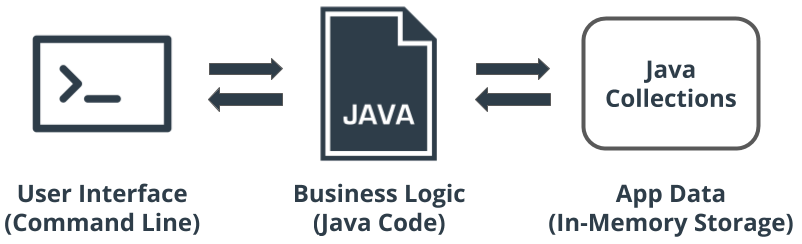
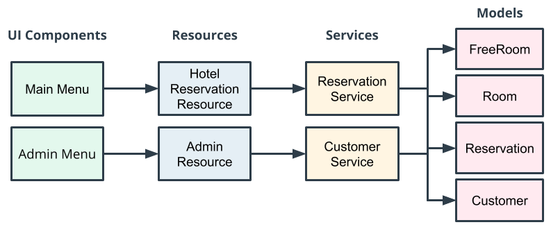

# Hotel Reservation Application

In this project, I designed and implemented a Java hotel reservation application.

The hotel reservation application allows customers to find and book a hotel room based on room availability.

This project demonstrates my abilities to design classes using OOP, organize and process data with collections, and use
common Java types.

## Index

1. [Getting Started](#getting-started)
    - [Prerequisites](#prerequisites)
    - [Quickstart](#quickstart)
2. [Main Components of the App](#main-components-of-the-app)
3. [Application Architecture](#application-architecture)
4. [Mandatory Project Requirements](#mandatory-project-requirements)
    - [User Scenarios](#user-scenarios)
    - [Admin Scenarios](#admin-scenarios)
    - [Reserving a Room](#reserving-a-room)
    - [Room](#room)
    - [Customer](#customer)
    - [Error Requirements](#error-requirements)
5. [Implemented Optional Project Requirements](#implemented-optional-project-requirements)

## Getting Started

### Prerequisites

- Java 17 or higher
- An IDE

### Quickstart

1. Download the zip or clone the repository.
2. Open the project in an IDE.
3. Run the `HotelApplication` class.

## Main Components of the App

The major components of the Hotel Reservation Application will consist of the following:

1. **Command Line Interface (CLI) for the User Interface (UI)** - Java will monitor the CLI for user input, so the user
   can enter commands.
2. **Java code** - business logic.
3. **Java collections** - in-memory storage of the data we need for the app.

## Application Architecture

Let's talk about the structure or architecture of the application. The app will be separated into the following layers:

1. **UI**, including a main menu for the users, and an admin menu for administrative functions.
2. **Resources** will act as the Application Programming Interface (API) to the UI.
3. **Services** will communicate with the resources to build the business logic necessary to provide feedback to the UI.
4. **Data models** will be used to represent the domain that we're using within the system (Customer, Room,
   Reservation).

## Mandatory Project Requirements

### User Scenarios

The application provides four user scenarios:

- **Creating a customer account**

The user needs to first create a customer account before they can create a reservation.

- **Searching for rooms**

The app should allow the user to search for available rooms based on provided checkin and checkout dates.
If the application has available rooms for the specified date range, a list of the corresponding rooms will be displayed
to the user for choosing.

- **Booking a room**

Once the user has chosen a room, the app will allow them to book the room and create a reservation.

- **Viewing reservations**

After booking a room, the app allows customers to view a list of all their reservations.

### Admin Scenarios

The application provides four administrative scenarios:

- **Displaying all customers accounts**
- **Viewing all the rooms in the hotel**
- **Viewing all the hotel reservations**
- **Adding a room to the hotel application**

### Reserving a Room

The application allows customers to reserve a room. Here are the specifics:

- **Avoid conflicting reservations**

A single room may only be reserved by a single customer per check-in and check-out date range.

- **Search for recommended rooms**

If there are no available rooms for the customer's date range, a search will be performed that displays recommended
rooms on alternative dates.

The recommended room search will add seven days to the original check-in and check-out dates to see if the hotel has any
availabilities and then display the recommended rooms/dates to the customer.

**Example:** If the customers date range search is 1/1/2020 – 1/5/2020 and all rooms are booked, the system will search
again for recommended rooms using the date range 1/8/2020 - 1/12/2020.
If there are no recommended rooms, the system
will not return any rooms.

### Room

- **Room cost**

Rooms will contain a price per night.
When displaying rooms, paid rooms will display the price per night and free rooms will display "Free" or have a $0
price.

- **Unique room numbers**

Each room will have a unique room number, meaning that no two rooms can have the same room number.

- **Room type**

Rooms can be either single occupant or double occupant.

### Customer

The application will have customer accounts. Each account has:

- **A unique email for the customer**

RegEx is used to check that the email is in the correct format (i.e., name@domain.com).

- **A first name and last name**

The email RegEx is simple for the purpose of this exercise and may not cover all real-world valid emails.

### Error Requirements

The hotel reservation application handles all exceptions gracefully (user inputs included), meaning:

- **No crashing**

The application does not crash based on user input.

- **No unhandled exceptions**

The app has try and catch blocks that are used to capture exceptions and provide useful information to the user.
There are no unhandled exceptions.

## Implemented Optional Project Requirements

1. Customize the find-a-room method to search for paid rooms or free rooms.
2. Provide a menu option from the Admin menu to populate the system with test data (Customers, Rooms and Reservations).
3. Allow the users to input how many days out the room recommendation should search if there are no available rooms.